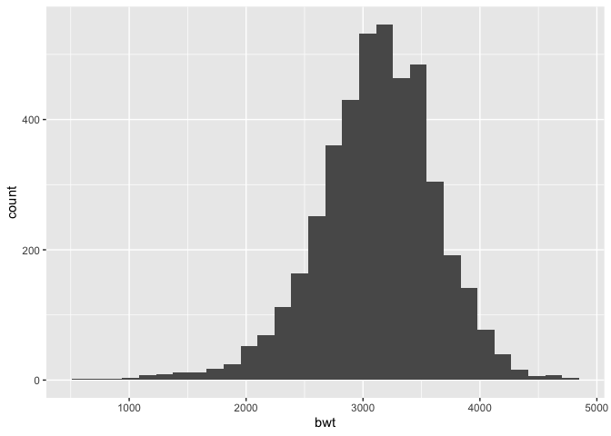
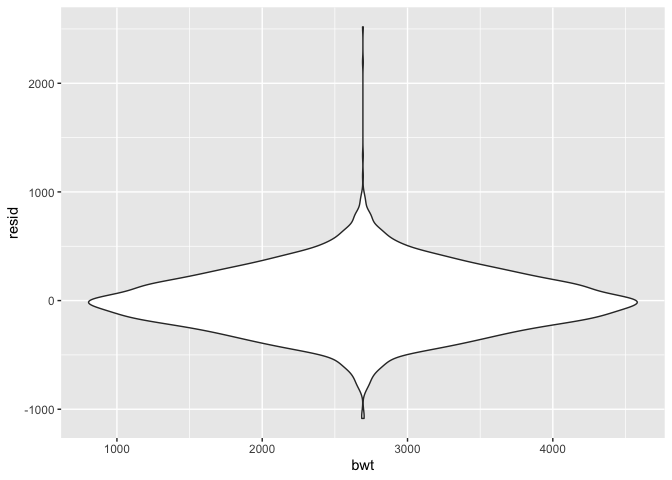
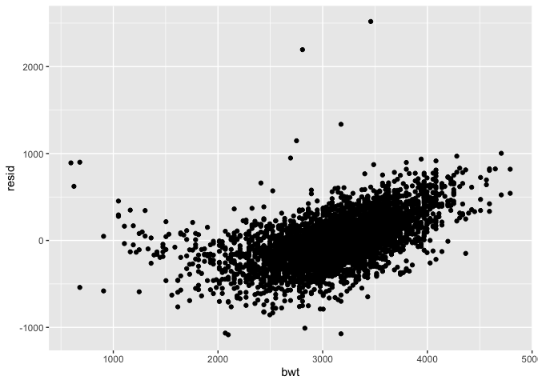
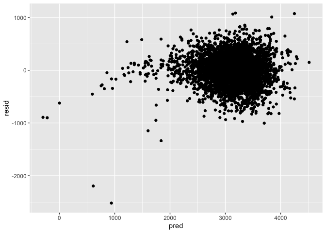
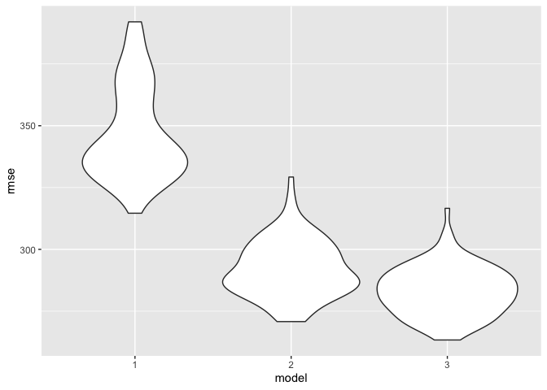
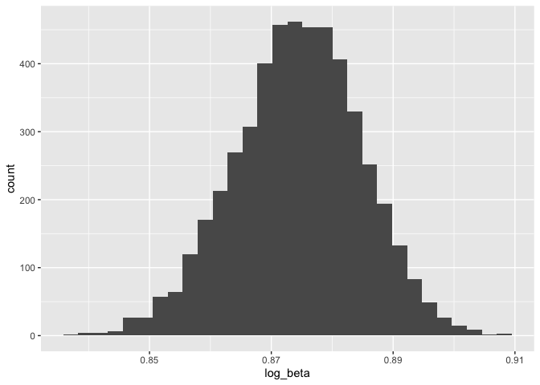
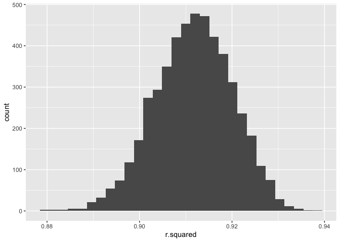

homework 6
================
lauren franks, lef2147
11/20/2019

## Question 1

Load and Tidy Data \* Load and clean the data for regression analysis
(i.e. convert numeric to factor where appropriate, check for missing
data, etc.).

``` r
bw_data = read_csv("birthweight.csv") %>% 
  janitor::clean_names() %>% 
  mutate(
    babysex = as.factor(babysex),
    frace = as.factor(frace),
    malform = as.factor(malform),
    mrace = as.factor(mrace)
  )
```

    ## Parsed with column specification:
    ## cols(
    ##   .default = col_double()
    ## )

    ## See spec(...) for full column specifications.

``` r
skimr::skim(bw_data)
```

    ## Skim summary statistics
    ##  n obs: 4342 
    ##  n variables: 20 
    ## 
    ## ── Variable type:factor ─────────────────────────────────────────────────────────────────────────────────────────────────────────────────────────────────────────────────────────────
    ##  variable missing complete    n n_unique                      top_counts
    ##   babysex       0     4342 4342        2         1: 2230, 2: 2112, NA: 0
    ##     frace       0     4342 4342        5 1: 2123, 2: 1911, 4: 248, 3: 46
    ##   malform       0     4342 4342        2           0: 4327, 1: 15, NA: 0
    ##     mrace       0     4342 4342        4 1: 2147, 2: 1909, 4: 243, 3: 43
    ##  ordered
    ##    FALSE
    ##    FALSE
    ##    FALSE
    ##    FALSE
    ## 
    ## ── Variable type:numeric ────────────────────────────────────────────────────────────────────────────────────────────────────────────────────────────────────────────────────────────
    ##  variable missing complete    n      mean     sd     p0     p25     p50
    ##     bhead       0     4342 4342   33.65     1.62  21      33      34   
    ##   blength       0     4342 4342   49.75     2.72  20      48      50   
    ##       bwt       0     4342 4342 3114.4    512.15 595    2807    3132.5 
    ##     delwt       0     4342 4342  145.57    22.21  86     131     143   
    ##   fincome       0     4342 4342   44.11    25.98   0      25      35   
    ##   gaweeks       0     4342 4342   39.43     3.15  17.7    38.3    39.9 
    ##  menarche       0     4342 4342   12.51     1.48   0      12      12   
    ##   mheight       0     4342 4342   63.49     2.66  48      62      63   
    ##    momage       0     4342 4342   20.3      3.88  12      18      20   
    ##    parity       0     4342 4342    0.0023   0.1    0       0       0   
    ##   pnumlbw       0     4342 4342    0        0      0       0       0   
    ##   pnumsga       0     4342 4342    0        0      0       0       0   
    ##     ppbmi       0     4342 4342   21.57     3.18  13.07   19.53   21.03
    ##      ppwt       0     4342 4342  123.49    20.16  70     110     120   
    ##    smoken       0     4342 4342    4.15     7.41   0       0       0   
    ##    wtgain       0     4342 4342   22.08    10.94 -46      15      22   
    ##      p75   p100     hist
    ##    35      41   ▁▁▁▁▅▇▁▁
    ##    51      63   ▁▁▁▁▁▇▁▁
    ##  3459    4791   ▁▁▁▃▇▇▂▁
    ##   157     334   ▁▇▅▁▁▁▁▁
    ##    65      96   ▁▂▇▂▂▂▁▃
    ##    41.1    51.3 ▁▁▁▁▃▇▁▁
    ##    13      19   ▁▁▁▁▂▇▁▁
    ##    65      77   ▁▁▁▅▇▂▁▁
    ##    22      44   ▂▇▅▂▁▁▁▁
    ##     0       6   ▇▁▁▁▁▁▁▁
    ##     0       0   ▁▁▁▇▁▁▁▁
    ##     0       0   ▁▁▁▇▁▁▁▁
    ##    22.91   46.1 ▁▇▅▁▁▁▁▁
    ##   134     287   ▁▇▆▁▁▁▁▁
    ##     5      60   ▇▁▁▁▁▁▁▁
    ##    28      89   ▁▁▁▇▇▁▁▁

There is no missing data in this dataset.

Visualizing Birthweight - slight left skew

``` r
bw_data %>% 
  ggplot(aes(bwt)) + geom_histogram()
```

    ## `stat_bin()` using `bins = 30`. Pick better value with `binwidth`.

<!-- -->

Propose a regression model for birthweight. This model may be based on a
hypothesized structure for the factors that underly birthweight, on a
data-driven model-building process, or a combination of the two.
Describe your modeling process and show a plot of model residuals
against fitted values – use add\_predictions and add\_residuals in
making this plot. \* evaluate multicolinearity and remove variables that
could be multicollinearity \* build models and take out variables that
have high standard deviation, insignificant p values, or have other
factors in the model that can be explained by other variables in the
model (e.g. mother’s weight, age)

``` r
# fitting a model with every variable in the dataset
fit = lm(bwt ~ ., data = bw_data)

# car::vif(fit)
```

Error given here indicates that there is extreme high collinearity going
on, so we will fit a model with less variables and reassess
multicollinearity. We will remove variables that are repetitive

There are three variables that describe number of previous births
(parity, pnumlbw, pnumsga) and four variables that explain mom’s weight
(ppbmi, ppwt, wtgain, delwt) we will choose only one/two variable in
each category to keep and reassess
multicollinearity

``` r
fit_1 = lm(bwt ~ babysex + frace + malform + bhead + blength + fincome + gaweeks + menarche + mheight + momage + parity + smoken + ppwt + wtgain, data = bw_data)

car::vif(fit_1)
```

    ##              GVIF Df GVIF^(1/(2*Df))
    ## babysex  1.046425  1        1.022949
    ## frace    1.555103  4        1.056744
    ## malform  1.004228  1        1.002112
    ## bhead    1.826158  1        1.351354
    ## blength  1.771471  1        1.330966
    ## fincome  1.269632  1        1.126780
    ## gaweeks  1.249134  1        1.117647
    ## menarche 1.068621  1        1.033741
    ## mheight  1.331735  1        1.154008
    ## momage   1.307627  1        1.143515
    ## parity   1.014494  1        1.007221
    ## smoken   1.102719  1        1.050104
    ## ppwt     1.321174  1        1.149423
    ## wtgain   1.090754  1        1.044391

``` r
# there is no multicollinearity present, we can now evaluate the model 

summary.lm(fit_1)
```

    ## 
    ## Call:
    ## lm(formula = bwt ~ babysex + frace + malform + bhead + blength + 
    ##     fincome + gaweeks + menarche + mheight + momage + parity + 
    ##     smoken + ppwt + wtgain, data = bw_data)
    ## 
    ## Residuals:
    ##      Min       1Q   Median       3Q      Max 
    ## -1095.12  -185.30    -3.35   172.09  2347.79 
    ## 
    ## Coefficients:
    ##               Estimate Std. Error t value Pr(>|t|)    
    ## (Intercept) -6094.9101   140.1873 -43.477  < 2e-16 ***
    ## babysex2       28.5736     8.4706   3.373 0.000749 ***
    ## frace2       -133.5402    10.2583 -13.018  < 2e-16 ***
    ## frace3        -53.2739    41.2645  -1.291 0.196760    
    ## frace4       -101.0568    19.1785  -5.269 1.44e-07 ***
    ## frace8        -32.8640    73.2749  -0.449 0.653813    
    ## malform1        9.7899    70.6868   0.138 0.889854    
    ## bhead         130.7193     3.4516  37.872  < 2e-16 ***
    ## blength        75.0089     2.0229  37.080  < 2e-16 ***
    ## fincome         0.3083     0.1796   1.717 0.086012 .  
    ## gaweeks        11.5952     1.4665   7.907 3.33e-15 ***
    ## menarche       -3.4889     2.8957  -1.205 0.228321    
    ## mheight         6.9164     1.7982   3.846 0.000122 ***
    ## momage          0.8328     1.2206   0.682 0.495062    
    ## parity         95.3997    40.5108   2.355 0.018571 *  
    ## smoken         -4.7637     0.5868  -8.118 6.11e-16 ***
    ## ppwt            1.4192     0.2360   6.014 1.96e-09 ***
    ## wtgain          4.1289     0.3950  10.453  < 2e-16 ***
    ## ---
    ## Signif. codes:  0 '***' 0.001 '**' 0.01 '*' 0.05 '.' 0.1 ' ' 1
    ## 
    ## Residual standard error: 272.7 on 4324 degrees of freedom
    ## Multiple R-squared:  0.7176, Adjusted R-squared:  0.7164 
    ## F-statistic: 646.2 on 17 and 4324 DF,  p-value: < 2.2e-16

``` r
# remove malform because the standard error is extremely high and an insignificant p value
fit_2 = lm(bwt ~ babysex + frace + bhead + blength + fincome + gaweeks + menarche + mheight + momage + parity + smoken + ppwt + wtgain, data = bw_data)

summary.lm(fit_2)
```

    ## 
    ## Call:
    ## lm(formula = bwt ~ babysex + frace + bhead + blength + fincome + 
    ##     gaweeks + menarche + mheight + momage + parity + smoken + 
    ##     ppwt + wtgain, data = bw_data)
    ## 
    ## Residuals:
    ##      Min       1Q   Median       3Q      Max 
    ## -1095.10  -185.35    -3.15   172.02  2347.60 
    ## 
    ## Coefficients:
    ##               Estimate Std. Error t value Pr(>|t|)    
    ## (Intercept) -6094.5244   140.1437 -43.488  < 2e-16 ***
    ## babysex2       28.5562     8.4687   3.372 0.000753 ***
    ## frace2       -133.5705    10.2548 -13.025  < 2e-16 ***
    ## frace3        -53.3329    41.2576  -1.293 0.196191    
    ## frace4       -101.1120    19.1722  -5.274 1.40e-07 ***
    ## frace8        -32.9286    73.2651  -0.449 0.653134    
    ## bhead         130.7228     3.4511  37.878  < 2e-16 ***
    ## blength        75.0044     2.0224  37.086  < 2e-16 ***
    ## fincome         0.3078     0.1795   1.715 0.086451 .  
    ## gaweeks        11.5931     1.4663   7.906 3.34e-15 ***
    ## menarche       -3.4934     2.8952  -1.207 0.227641    
    ## mheight         6.9135     1.7978   3.845 0.000122 ***
    ## momage          0.8363     1.2202   0.685 0.493109    
    ## parity         95.3758    40.5058   2.355 0.018586 *  
    ## smoken         -4.7618     0.5866  -8.118 6.11e-16 ***
    ## ppwt            1.4193     0.2360   6.015 1.95e-09 ***
    ## wtgain          4.1307     0.3947  10.465  < 2e-16 ***
    ## ---
    ## Signif. codes:  0 '***' 0.001 '**' 0.01 '*' 0.05 '.' 0.1 ' ' 1
    ## 
    ## Residual standard error: 272.7 on 4325 degrees of freedom
    ## Multiple R-squared:  0.7176, Adjusted R-squared:  0.7165 
    ## F-statistic: 686.7 on 16 and 4325 DF,  p-value: < 2.2e-16

``` r
# remove momage; insignificant p value
fit_3 = lm(bwt ~ babysex + frace + bhead + blength + fincome + gaweeks + menarche + mheight + parity + smoken + ppwt + wtgain, data = bw_data)

summary.lm(fit_3)
```

    ## 
    ## Call:
    ## lm(formula = bwt ~ babysex + frace + bhead + blength + fincome + 
    ##     gaweeks + menarche + mheight + parity + smoken + ppwt + wtgain, 
    ##     data = bw_data)
    ## 
    ## Residuals:
    ##      Min       1Q   Median       3Q      Max 
    ## -1095.73  -184.87    -2.46   172.53  2348.47 
    ## 
    ## Coefficients:
    ##               Estimate Std. Error t value Pr(>|t|)    
    ## (Intercept) -6086.5752   139.6545 -43.583  < 2e-16 ***
    ## babysex2       28.3745     8.4641   3.352 0.000808 ***
    ## frace2       -135.2577     9.9544 -13.588  < 2e-16 ***
    ## frace3        -50.1804    40.9979  -1.224 0.221029    
    ## frace4       -101.8498    19.1408  -5.321 1.08e-07 ***
    ## frace8        -33.7983    73.2496  -0.461 0.644526    
    ## bhead         130.7456     3.4507  37.889  < 2e-16 ***
    ## blength        74.9853     2.0221  37.083  < 2e-16 ***
    ## fincome         0.3345     0.1752   1.909 0.056292 .  
    ## gaweeks        11.6493     1.4639   7.958 2.22e-15 ***
    ## menarche       -3.1152     2.8420  -1.096 0.273071    
    ## mheight         6.9078     1.7977   3.843 0.000124 ***
    ## parity         97.3974    40.3958   2.411 0.015947 *  
    ## smoken         -4.7644     0.5865  -8.123 5.86e-16 ***
    ## ppwt            1.4419     0.2336   6.172 7.35e-10 ***
    ## wtgain          4.1078     0.3933  10.445  < 2e-16 ***
    ## ---
    ## Signif. codes:  0 '***' 0.001 '**' 0.01 '*' 0.05 '.' 0.1 ' ' 1
    ## 
    ## Residual standard error: 272.7 on 4326 degrees of freedom
    ## Multiple R-squared:  0.7175, Adjusted R-squared:  0.7165 
    ## F-statistic: 732.6 on 15 and 4326 DF,  p-value: < 2.2e-16

``` r
# remove menarche; insignificant p value
fit_4 = lm(bwt ~ babysex + frace + bhead + blength + fincome + gaweeks + mheight + parity + smoken + ppwt + wtgain, data = bw_data)

summary.lm(fit_4)
```

    ## 
    ## Call:
    ## lm(formula = bwt ~ babysex + frace + bhead + blength + fincome + 
    ##     gaweeks + mheight + parity + smoken + ppwt + wtgain, data = bw_data)
    ## 
    ## Residuals:
    ##      Min       1Q   Median       3Q      Max 
    ## -1096.74  -186.25    -2.91   172.65  2357.70 
    ## 
    ## Coefficients:
    ##               Estimate Std. Error t value Pr(>|t|)    
    ## (Intercept) -6113.2456   137.5219 -44.453  < 2e-16 ***
    ## babysex2       28.4553     8.4639   3.362 0.000781 ***
    ## frace2       -135.3622     9.9542 -13.598  < 2e-16 ***
    ## frace3        -53.1360    40.9101  -1.299 0.194066    
    ## frace4       -102.5725    19.1299  -5.362 8.66e-08 ***
    ## frace8        -34.2140    73.2503  -0.467 0.640464    
    ## bhead         130.6727     3.4502  37.874  < 2e-16 ***
    ## blength        75.0357     2.0216  37.116  < 2e-16 ***
    ## fincome         0.3369     0.1752   1.923 0.054531 .  
    ## gaweeks        11.6309     1.4638   7.946 2.45e-15 ***
    ## mheight         6.6587     1.7833   3.734 0.000191 ***
    ## parity         96.4400    40.3873   2.388 0.016989 *  
    ## smoken         -4.7776     0.5864  -8.148 4.82e-16 ***
    ## ppwt            1.4713     0.2321   6.340 2.54e-10 ***
    ## wtgain          4.1340     0.3926  10.531  < 2e-16 ***
    ## ---
    ## Signif. codes:  0 '***' 0.001 '**' 0.01 '*' 0.05 '.' 0.1 ' ' 1
    ## 
    ## Residual standard error: 272.7 on 4327 degrees of freedom
    ## Multiple R-squared:  0.7174, Adjusted R-squared:  0.7165 
    ## F-statistic: 784.8 on 14 and 4327 DF,  p-value: < 2.2e-16

``` r
# remove fincome, frace; p value is marginally significant but we will remove this var (parsimony)
fit_5 = lm(bwt ~ babysex + bhead + blength + gaweeks + mheight + parity + smoken + ppwt + wtgain, data = bw_data)

summary.lm(fit_5)
```

    ## 
    ## Call:
    ## lm(formula = bwt ~ babysex + bhead + blength + gaweeks + mheight + 
    ##     parity + smoken + ppwt + wtgain, data = bw_data)
    ## 
    ## Residuals:
    ##      Min       1Q   Median       3Q      Max 
    ## -1090.67  -180.43    -6.83   176.33  2495.11 
    ## 
    ## Coefficients:
    ##               Estimate Std. Error t value Pr(>|t|)    
    ## (Intercept) -6716.9029   134.7922 -49.832  < 2e-16 ***
    ## babysex2       29.3662     8.6833   3.382 0.000726 ***
    ## bhead         136.4950     3.5146  38.837  < 2e-16 ***
    ## blength        77.5095     2.0673  37.493  < 2e-16 ***
    ## gaweeks        13.8986     1.4956   9.293  < 2e-16 ***
    ## mheight         9.5975     1.7875   5.369 8.32e-08 ***
    ## parity         99.1233    41.4750   2.390 0.016893 *  
    ## smoken         -2.3756     0.5794  -4.100 4.20e-05 ***
    ## ppwt            1.1197     0.2365   4.734 2.27e-06 ***
    ## wtgain          3.7003     0.4020   9.205  < 2e-16 ***
    ## ---
    ## Signif. codes:  0 '***' 0.001 '**' 0.01 '*' 0.05 '.' 0.1 ' ' 1
    ## 
    ## Residual standard error: 280.1 on 4332 degrees of freedom
    ## Multiple R-squared:  0.7015, Adjusted R-squared:  0.7009 
    ## F-statistic:  1131 on 9 and 4332 DF,  p-value: < 2.2e-16

``` r
# remove smoke and parity for parsimony while still keeping adjusted r squared high
fit_6 = lm(bwt ~ babysex + bhead + blength + gaweeks + mheight + ppwt + wtgain, data = bw_data)

summary.lm(fit_6)
```

    ## 
    ## Call:
    ## lm(formula = bwt ~ babysex + bhead + blength + gaweeks + mheight + 
    ##     ppwt + wtgain, data = bw_data)
    ## 
    ## Residuals:
    ##     Min      1Q  Median      3Q     Max 
    ## -1084.7  -184.8    -8.7   174.2  2518.9 
    ## 
    ## Coefficients:
    ##               Estimate Std. Error t value Pr(>|t|)    
    ## (Intercept) -6717.2049   135.0111 -49.753  < 2e-16 ***
    ## babysex2       31.5918     8.6912   3.635 0.000281 ***
    ## bhead         137.2663     3.5191  39.006  < 2e-16 ***
    ## blength        77.9946     2.0676  37.722  < 2e-16 ***
    ## gaweeks        13.1865     1.4908   8.845  < 2e-16 ***
    ## mheight         9.1569     1.7889   5.119 3.21e-07 ***
    ## ppwt            1.0913     0.2370   4.605 4.25e-06 ***
    ## wtgain          3.6580     0.4025   9.088  < 2e-16 ***
    ## ---
    ## Signif. codes:  0 '***' 0.001 '**' 0.01 '*' 0.05 '.' 0.1 ' ' 1
    ## 
    ## Residual standard error: 280.8 on 4334 degrees of freedom
    ## Multiple R-squared:    0.7,  Adjusted R-squared:  0.6995 
    ## F-statistic:  1444 on 7 and 4334 DF,  p-value: < 2.2e-16

``` r
summary(fit_1)$adj.r.squared
```

    ## [1] 0.716449

``` r
summary(fit_2)$adj.r.squared
```

    ## [1] 0.7165133

``` r
summary(fit_3)$adj.r.squared
```

    ## [1] 0.7165481

``` r
summary(fit_4)$adj.r.squared
```

    ## [1] 0.7165349

``` r
summary(fit_5)$adj.r.squared
```

    ## [1] 0.7008917

``` r
summary(fit_6)$adj.r.squared
```

    ## [1] 0.6994732

Model 5 has a large R squared adjusted value with the smallest number of
variables in the model, while keeping everything significant.

Using Model 5

``` r
modelr::add_residuals(bw_data, fit_6) %>% 
  ggplot(aes(bwt, resid)) + geom_violin()
```

<!-- -->

``` r
modelr::add_residuals(bw_data, fit_6) %>% 
  ggplot(aes(bwt, resid)) + geom_point()
```

<!-- -->

``` r
# modeling both predicted values against redsiduals
modelr::add_predictions(bw_data, fit_6) %>% 
  mutate(
    resid = pred - bwt
  ) %>% 
  ggplot(aes(pred, resid)) + geom_point()
```

<!-- -->

``` r
# aside from a few outliers, the residuals are evenly scattered about 0
```

Comparing model to two other models: \* One using length at birth and
gestational age as predictors (main effects only) \* One using head
circumference, length, sex, and all interactions (including the
three-way interaction) between these

``` r
model_1 = lm(bwt ~ blength + menarche, data = bw_data)

summary.lm(model_1)
```

    ## 
    ## Call:
    ## lm(formula = bwt ~ blength + menarche, data = bw_data)
    ## 
    ## Residuals:
    ##     Min      1Q  Median      3Q     Max 
    ## -1789.9  -223.7    -6.9   217.9  4495.4 
    ## 
    ## Coefficients:
    ##              Estimate Std. Error t value Pr(>|t|)    
    ## (Intercept) -3801.517    105.683 -35.971   <2e-16 ***
    ## blength       139.776      1.910  73.196   <2e-16 ***
    ## menarche       -3.038      3.519  -0.863    0.388    
    ## ---
    ## Signif. codes:  0 '***' 0.001 '**' 0.01 '*' 0.05 '.' 0.1 ' ' 1
    ## 
    ## Residual standard error: 342.6 on 4339 degrees of freedom
    ## Multiple R-squared:  0.5528, Adjusted R-squared:  0.5526 
    ## F-statistic:  2682 on 2 and 4339 DF,  p-value: < 2.2e-16

``` r
model_2 = lm(bwt ~ bhead + blength + babysex + bhead*blength + bhead*babysex + babysex*blength, data = bw_data)

summary.lm(model_2)
```

    ## 
    ## Call:
    ## lm(formula = bwt ~ bhead + blength + babysex + bhead * blength + 
    ##     bhead * babysex + babysex * blength, data = bw_data)
    ## 
    ## Residuals:
    ##     Min      1Q  Median      3Q     Max 
    ## -1133.8  -189.7    -7.2   178.8  2721.8 
    ## 
    ## Coefficients:
    ##                    Estimate Std. Error t value Pr(>|t|)    
    ## (Intercept)      -3768.3047   859.9205  -4.382  1.2e-05 ***
    ## bhead               79.5055    25.9480   3.064  0.00220 ** 
    ## blength             31.5110    17.8264   1.768  0.07719 .  
    ## babysex2           259.9785   197.9105   1.314  0.18904    
    ## bhead:blength        1.5608     0.5269   2.962  0.00307 ** 
    ## bhead:babysex2     -12.6620     7.0450  -1.797  0.07236 .  
    ## blength:babysex2     4.2107     4.1691   1.010  0.31257    
    ## ---
    ## Signif. codes:  0 '***' 0.001 '**' 0.01 '*' 0.05 '.' 0.1 ' ' 1
    ## 
    ## Residual standard error: 288.1 on 4335 degrees of freedom
    ## Multiple R-squared:  0.6839, Adjusted R-squared:  0.6835 
    ## F-statistic:  1563 on 6 and 4335 DF,  p-value: < 2.2e-16

Make this comparison in terms of the cross-validated prediction error;
use crossv\_mc and functions in purrr as appropriate.

``` r
train = sample_frac(bw_data, size = 0.8)
test = anti_join(bw_data, train)
```

    ## Joining, by = c("babysex", "bhead", "blength", "bwt", "delwt", "fincome", "frace", "gaweeks", "malform", "menarche", "mheight", "momage", "mrace", "parity", "pnumlbw", "pnumsga", "ppbmi", "ppwt", "smoken", "wtgain")

``` r
cv_df = crossv_mc(bw_data, 100)

cv_df =
  cv_df %>% 
  mutate(
    train = map(train, as_tibble),
    test = map(test, as_tibble)
  )

cv_results = cv_df %>% 
  mutate(
    model_1 = map(.x = train, ~lm(bwt ~ blength + menarche, data = .x)),
    model_2 = map(.x = train, ~lm(bwt ~ bhead + blength + babysex + bhead*blength + bhead*babysex + babysex*blength, data = .x)),
    fit_6 = map(.x = train, ~lm(bwt ~ babysex + bhead + blength + gaweeks + mheight + ppwt + parity + smoken + wtgain, data = .x)),
    rmse_1 = map2(.x = model_1, .y = test, ~rmse(.x, .y)),
    rmse_2 = map2(.x = model_2, .y = test, ~rmse(.x, .y)),
    rmse_3 = map2(.x = fit_6, .y = test, ~rmse(.x, .y)),
  )
```

    ## Warning in predict.lm(model, data): prediction from a rank-deficient fit
    ## may be misleading
    
    ## Warning in predict.lm(model, data): prediction from a rank-deficient fit
    ## may be misleading

``` r
 cv_results %>% select(starts_with("rmse")) %>% 
   pivot_longer(
     everything(),
     names_to = "model", 
     values_to = "rmse",
     names_prefix = "rmse_") %>% unnest() %>% 
   mutate(model = fct_inorder(model)) %>% 
   ggplot(aes(x = model, y = rmse)) + geom_violin()
```

    ## Warning: `cols` is now required.
    ## Please use `cols = c(rmse)`

<!-- -->

The RMSE for model 1 and model 2 have significant bimodalality going on.
Model three has a lower RMSE but it is constant with no peaks present.
Based on this, adjusted R squared values, and significance of the
variables in the model, we can conclude that Model 3 is the best
predictive model.

## Question 2

For this problem, we’ll use the 2017 Central Park weather data that
we’ve seen elsewhere. The code chunk below (adapted from the course
website) will download these data.

``` r
weather_df = 
  rnoaa::meteo_pull_monitors(
    c("USW00094728"),
    var = c("PRCP", "TMIN", "TMAX"), 
    date_min = "2017-01-01",
    date_max = "2017-12-31") %>%
  mutate(
    name = recode(id, USW00094728 = "CentralPark_NY"),
    tmin = tmin / 10,
    tmax = tmax / 10) %>%
  select(name, id, everything())
```

    ## Registered S3 method overwritten by 'crul':
    ##   method                 from
    ##   as.character.form_file httr

    ## Registered S3 method overwritten by 'hoardr':
    ##   method           from
    ##   print.cache_info httr

    ## file path:          /Users/laurenfranks/Library/Caches/rnoaa/ghcnd/USW00094728.dly

    ## file last updated:  2019-09-03 11:05:45

    ## file min/max dates: 1869-01-01 / 2019-08-31

The boostrap is helpful when you’d like to perform inference for a
parameter / value / summary that doesn’t have an easy-to-write-down
distribution in the usual repeated sampling framework. We’ll focus on a
simple linear regression with tmax as the response and tmin as the
predictor, and are interested in the distribution of two quantities
estimated from these data: \* r̂2 \* log(β̂0∗β̂1)

Use 5000 bootstrap samples and, for each bootstrap sample, produce
estimates of these two quantities. Plot the distribution of your
estimates, and describe these in words. Using the 5000 bootstrap
estimates, identify the 2.5% and 97.5% quantiles to provide a 95%
confidence interval for r̂2 and log(β̂0∗β̂1). Note: broom::glance() is
helpful for extracting r̂2 from a fitted regression, and broom::tidy()
(with some additional wrangling) should help in computing log(β̂0∗β̂1)

``` r
# finding the rsqaured value 
r_squared = weather_df %>% 
  modelr::bootstrap(n = 5000) %>% 
  mutate(
    models = map(strap, ~lm(tmax ~ tmin, data = .x)),
    results = map(models, broom::glance)) %>% 
  select(-strap, -models) %>% 
  unnest(results) %>% 
  select(.id, r.squared)
  
# find log(beta1 * beta0)
betas = weather_df %>% 
  modelr::bootstrap(n = 5000) %>% 
  mutate(
    models = map(strap, ~lm(tmax ~ tmin, data = .x)),
    results = map(models, broom::tidy)) %>% 
  select(-strap, -models) %>% 
  unnest(results) %>%
  select(.id, term, estimate) %>% 
  pivot_wider(
    names_from = term,
    values_from = estimate
  ) %>% 
  rename(
    intercept = "(Intercept)"
  ) %>% 
  mutate(
    log_beta = log10(intercept * tmin)
  )

# combind the two datasets together
data = left_join(betas, r_squared, by = ".id")

# compute 95% confidence intervals for r squared
mean_r_sq = mean(pull(data, r.squared))
sd_r_sq = sd(pull(data, r.squared))
# lower bound 
mean_r_sq - qnorm(0.975) * sd_r_sq*sqrt(5000)
```

    ## [1] -0.2508782

``` r
# upper bound 
mean_r_sq + qnorm(0.975) * sd_r_sq*sqrt(5000)
```

    ## [1] 2.074258

``` r
# compute 95% confidence intervals for log(beta1 * beta0)
mean_beta = mean(pull(data, log_beta))
sd_beta = sd(pull(data, log_beta))
# lower bound 
mean_beta - qnorm(0.975) * sd_beta*sqrt(5000)
```

    ## [1] -0.5695328

``` r
# upper bound 
mean_beta + qnorm(0.975) * sd_beta*sqrt(5000)
```

    ## [1] 2.318246

``` r
# plot distributions - histogram
data %>% ggplot(aes(log_beta)) + 
  geom_histogram()
```

    ## `stat_bin()` using `bins = 30`. Pick better value with `binwidth`.

<!-- -->

``` r
data %>% ggplot(aes(r.squared)) + 
  geom_histogram()
```

    ## `stat_bin()` using `bins = 30`. Pick better value with `binwidth`.

<!-- -->
The 95% confidence interval for r squared value is (-0.239, 2.062) and
the 95% confidence interval for log(beta1\*beta0) is (-0.583, 2.332).
The distributions for both r squared and log\_beta are normal, with r
squared ranging from 0.8791537 to `max(pull(data, r.squared))` with a
mean of 0.9116898 and log\_beta ranging from `min(pull(data, log_beta))`
to `max(pull(data, log_beta))` with a mean of 0.8743569.
